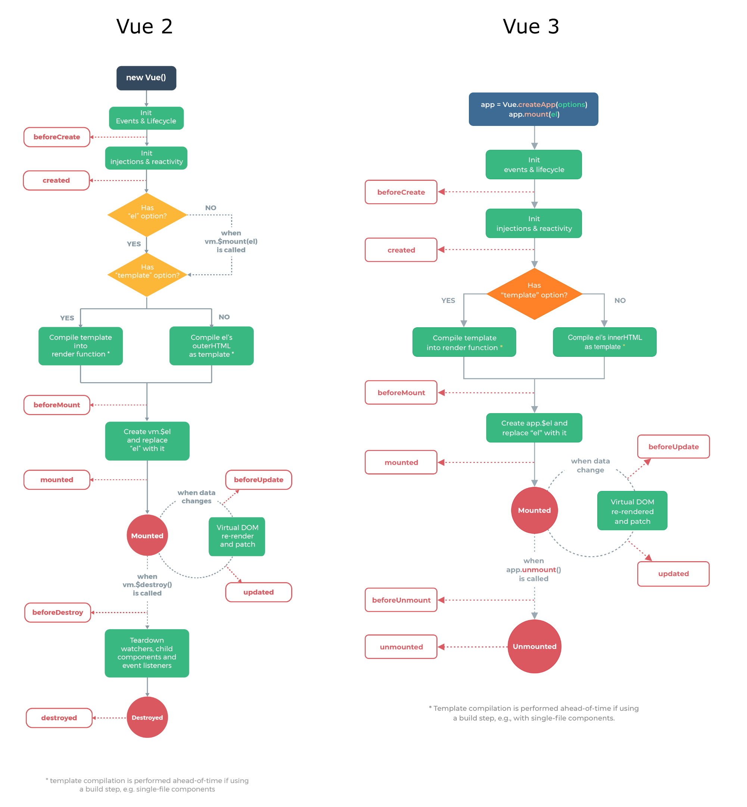

## 3-5. Vue 인스턴스 라이프 사이클

 

#### 1. beforeCreate
Vue 인스턴스가 생성되고 데이터에 대한 관찰 기능 및 이벤트 감시자 설정 간에 호출된다.

 

#### 2. created
Vue 인스턴스가 생성된 후에 데이터에 대한 관찰 기능, 계산형 속성, 메서드, 감시자 설정이 완료된 후에 호출된다.

 

#### 3. beforeMount
마운트가 시작되기 전에 호출된다.

 

#### 4. mounted
el에 vue 인스턴스의 데이터가 마운트된 후에 호출된다.

 

#### 5. beforeUpdate
가상 DOM이 렌더링, 패치되기 전에 데이터가 변경될 때 호출된다.  
이 훅에서 추가적인 상태 변경을 수행할 수 있다.  
하지만 추가로 다시 렌더링하지는 않는다.

 

#### 6. updated
데이터의 변경으로 가상 DOM이 다시 렌더링되고 패치된 후에 호출된다.  
이 훅이 호출되었을 때는 이미 컴포넌트의 DOM이 업데이트된 상태이다.  
그래서 DOM에 종속성이 있는 연산을 이 단계에서 수행할 수 있다.

 

#### 7. beforeDestroy
Vue 인스턴스가 제거되기 전에 호출된다.

 

#### 8. destroyed
Vue 인스턴스가 제거된 후에 호출된다.  
이 훅이 호출될 때는 Vue 인스턴스의 모든 디렉티브의 바인딩이 해제되고, 이벤트 연결도 모두 제거된다.